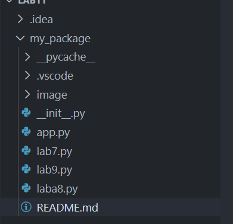
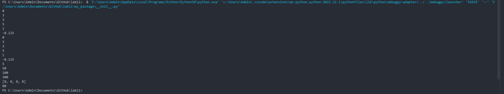
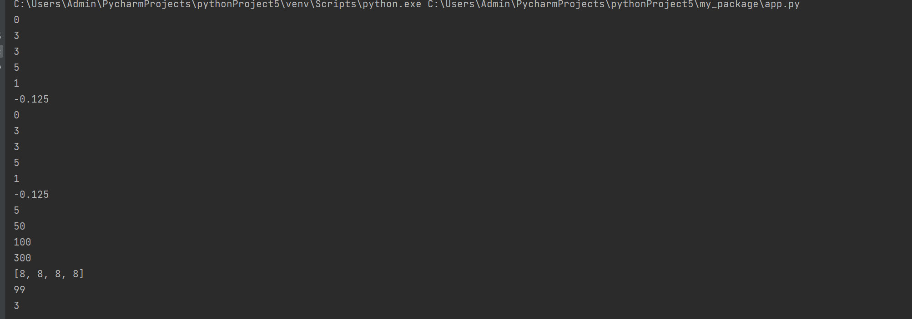

### Прог. Лабораторная работа №10
Задания для самостоятельного выполнения

Сложность:
Rare
1.Создайте пакет, содержащий 3 модуля на основе лабораторных работ №№ 7-9

2.Напишите запускающий модуль на основе Typer, который позволит выбирать и настраивать параметры запуска логики из пакета.

Оформите отчёт в README.md. Отчёт должен содержать:

Условия задач

Описание проделанной работы

Скриншоты результатов

Ссылки на используемые материалы

## Решение 
1.сперва я создал пакет, содержащий 3 модуля на основе лабораторных работ №7-9



 2.затем добавил файл  __init__.py в папку своего пакета. Этот файл нужен для того, чтобы Python распознал папку как пакет.
 
 3. В файл __init__.py импортировал  все функции и переменные из модулей lab7, lab8 и lab9
```python

from lab7 import count, calculate_xi
from laba8 import make_calc, f
from lab9 import generate_random_number
 ```
 Программа выводит в терминал следующее 

 

 4.затем создал файл app.py для того чтобы  импортировать функцию count из модуля lab7 следующим образом:

```python
from my_package import count

result = count([1, 2, 3])
print(result)
```
 Программа выводит в терминал следующее

 

### Список использованных источников

1.https://younglinux.info/oopython/module